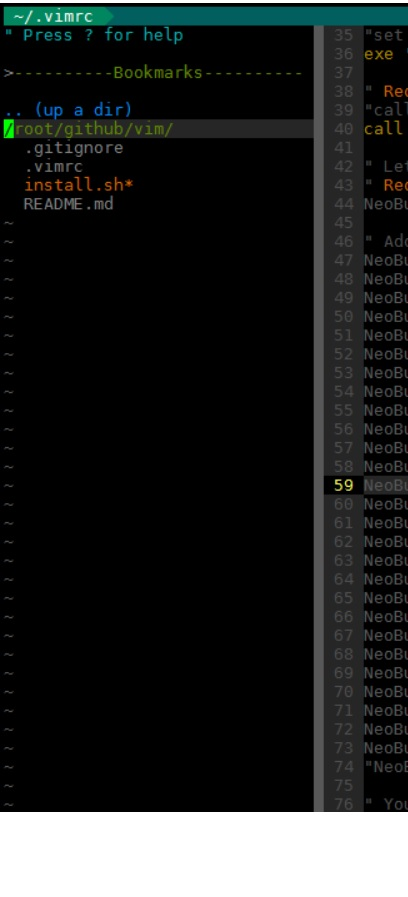

vim-gigix
=========
<!--
https://ecotrust-canada.github.io/markdown-toc/
-->

- [Presentation](#presentation)
- [Installation](#installation)
- [Learn VIM](#learn-vim)
- [Key mapping](#key-mapping)
  * [Original VIM key mapping](#original-vim-key-mapping)
    + [Builtin key mapping without plugin or remapping](#builtin-key-mapping-without-plugin-or-remapping)
      - [Yank](#yank)
      - [Change](#change)
      - [Delete](#delete)
      - [Select](#select)
      - [Change mode](#change-mode)
      - [Move cursor](#move-cursor)
      - [Replace](#replace)
      - [Other](#other)
    + [Play with registers](#play-with-registers)
    + [Play with marks](#play-with-marks)
    + [Play with split](#play-with-split)
    + [Play with folding](#play-with-folding)
  * [Plugin key mapping](#plugin-key-mapping)
- [Modules](#modules)
  * [vim-cursor](#vim-cursor)
  * [vim-colors-solarized](#vim-colors-solarized)
  * [vim-airline](#vim-airline)
  * [vim-airline-themes](#vim-airline-themes)
  * [vim-indent-guides](#vim-indent-guides)
  * [auto-pairs](#auto-pairs)
  * [vim-multiple-cursors](#vim-multiple-cursors)
  * [matchit.zip](#matchitzip)
  * [vim-easy-align](#vim-easy-align)
  * [vim-easymotion](#vim-easymotion)
  * [vim-surround](#vim-surround)
  * [vim-repeat](#vim-repeat)
  * [wildfire.vim](#wildfirevim)
  * [nerdcommenter](#nerdcommenter)
  * [syntastic](#syntastic)
  * [nerdtree](#nerdtree)
  * [vim-fugitive](#vim-fugitive)
  * [vim-signify](#vim-signify)
  * [ctrlp.vim](#ctrlpvim)
  * [rainbow](#rainbow)
  * [HTML-AutoCloseTag](#html-autoclosetag)
  * [gundo.vim](#gundovim)
  * [tagbar](#tagbar)
  * [YouCompleteMe](#youcompleteme)
    + [Requirements](#requirements)
    + [Compilation](#compilation)
  * [vim-snippets](#vim-snippets)
  * [ultisnips](#ultisnips)
- [Tips](#tips)
- [Troubleshooting](#troubleshooting)


Presentation
------------
Plugins and customization for VIM.

Inspired by [spf13-vim](http://vim.spf13.com/).
 * More reactive
 * More fast to load


Installation
------------
```sh
curl https://raw.githubusercontent.com/gigi206/vim-gigix/master/install.sh -L -o - | bash
```

Learn VIM
---------
 * [Learn VIM with podcast](https://podfanatic.com/podcast/vimcasts?page=1)


Key mapping
-----------
<!--
Generate table md  => http://www.tablesgenerator.com/markdown_tables
Viewer for md file => http://dillinger.io/
-->

### Original VIM key mapping
[Vim Cheat Sheet](https://vim.rtorr.com/)

#### Builtin key mapping without plugin or remapping

##### Yank

| Keystrokes                                                       |   Mode  | Description                                                                           |
|------------------------------------------------------------------|:-------:|---------------------------------------------------------------------------------------|
| `yi(` or `yi)` or `ya(` or `ya)` or `yib` or `yab`               |    N    | Copy `( <text> )` block                                                               |
| `yi[` or `yi]` or `ya[` or `ya]`                                 |    N    | Copy `[ <text> ]` block                                                               |
| `yi{` or `yi}` or `ya{` or `ya}` or `yiB` or `yaB`               |    N    | Copy `{ <text> }` block                                                               |
| `yi<` or `yi>` or `ya<` or `ya>`                                 |    N    | Copy ` < <text> >` block                                                              |
| `yi"` or `ya"`                                                   |    N    | Copy `" <text> "` block                                                               |
| `yi'` or `ya'`                                                   |    N    | Copy `' <text> '` block                                                               |
| ``yi` `` or ``ya` ``                                             |    N    | Copy `` ` <text> ` `` block                                                           |
| `yit` or `yat`                                                   |    N    | Copy `<tag> <text> </tag>` block                                                      |
| `yy` or `Y`                                                      |    N    | Copy line to the register                                                             |
| `yf<letter>`                                                     |    N    | Copy from cursor to `<letter>`                                                        |
| `yw` or `yiw` or `yaw` or `yW` or `yaW` or `yiW` or `ye` or `yE` |    N    | Copy from cursor to the end word                                                      |
| `yb` or `yB`                                                     |    N    | Copy from cursor to the begin word                                                    |
| `yap` or `yip`                                                   |    N    | Copy the current block                                                                |
| `y` or `Y`                                                       |    V    | Copy highlight text                                                                   |


##### Change

| Keystrokes                                                       |   Mode  | Description                                                                           |
|------------------------------------------------------------------|:-------:|---------------------------------------------------------------------------------------|
| `cgn`                                                            |    N    | Change the previous search                                                               |
| `cf<letter>`                                                     |    N    | Change from cursor to `<letter>`                                                         |
| `cw` or `ciw` or `caw` or `cW` or `caW` or `ciW` or `ce` or `cE` |    N    | Change from cursor to the end word                                                       |
| `cb` or `cB`                                                     |    N    | Change from cursor to the begin word                                                     |
| `cap` or `cip`                                                   |    N    | Change the current block                                                                 |
| `ci(` or `ci)` or `ca(` or `ca)` or `cib` or `cab`               |    N    | Change `( <text> )` block                                                                |
| `ci[` or `ci]` or `ca[` or `ca]`                                 |    N    | Change `[ <text> ]` block                                                                |
| `ci{` or `ci}` or `ca{` or `ca}` or `ciB` or `caB`               |    N    | Change `{ <text> }` block                                                                |
| `ci<` or `ci>` or `ca<` or `ca>`                                 |    N    | Change `< <text> >` block                                                                |
| `ci"` or `ca"`                                                   |    N    | Change `" <text> "` block                                                                |
| `ci'` or `ca'`                                                   |    N    | Change `' <text> '` block                                                                |
| ``ci` `` or ``ca` ``                                             |    N    | Change `` ` <text> ` `` block                                                            |
| `cit` or `cat`                                                   |    N    | Change `<tag> <text> </tag>` block                                                       |
| `c` or `s` or `C` or `S`                                         |    V    | Change the slected text in buffer et go to insert mode                                   |
| `c`                                                              |    V    | Change the highlight text                                                                |


##### Delete

| Keystrokes                                                       |   Mode  | Description                                                                           |
|------------------------------------------------------------------|:-------:|---------------------------------------------------------------------------------------|
| `df<letter>`                                                     |    N    | Delete from cursor to `<letter>`                                                      |
| `dw` or `diw` or `daw` or `dW` or `daW` or `diW` or `de` or `dE` |    N    | Delete from cursor to the end word                                                    |
| `db` or `dB`                                                     |    N    | Delete from cursor to the begin word                                                  |
| `dap` or `dip`                                                   |    N    | Delete the current block                                                              |
| `di(` or `di)` or `da(` or `da)` or `dib` or `dab`               |    N    | Delete `( <text> )` block                                                             |
| `di[` or `di]` or `da[` or `da]`                                 |    N    | Delete `[ <text> ]` block                                                             |
| `di{` or `di}` or `da{` or `da}` or `diB` or `daB`               |    N    | Delete `{ <text> }` block                                                             |
| `di<` or `di>` or  `da<` or `da>`                                |    N    | Delete `< <text> >` block                                                             |
| `di"` or `da"`                                                   |    N    | Delete `" <text> "` block                                                             |
| `di'` or `da'`                                                   |    N    | Delete `' <text> '` block                                                             |
| ``di` `` or ``da` ``                                             |    N    | Delete `` ` <text> ` `` block                                                         |
| `dit` or `dat`                                                   |    N    | Delete `<tag> <text> </tag>` block                                                    |
| `dd`                                                             |    N    | Delete the current line                                                               |
| `S`                                                              |    N    | Delete the current line and change to insert mode                                     |
| `D`                                                              |    N    | Delete from cursor to end end of line                                                 |
| `C`                                                              |    N    | Same as D but change in insert mode                                                   |
| `x` or `Del`                                                     |    N    | Delete char                                                                           |
| `<C-u>`                                                          |    I    | Delete from cursor to start of the line                                               |
| `<C-w>`                                                          |    I    | Delete previous word                                                                  |
| `d` or `D` or `x` or `X`                                         |    V    | Delete hightlith text                                                                 |


##### Select

| Keystrokes                                                       |   Mode  | Description                                                                           |
|------------------------------------------------------------------|:-------:|---------------------------------------------------------------------------------------|
| `{` or `}` or `a{` or `iw` or `aB` or `iB`                       |    V    | Highlight from cursor to the start or end of block or hilight text between `{` or `}` |
| `i[`or `i]` or `a[`or `a]`                                       |    V    | Highlight `[ <text> ]` block                                                          |
| `i(` or `i)` or `a(` or `a)` or `ib` or `ab`                     |    V    | Highlight `( <text> )` block                                                          |
| `i<` or `i>` or `a<` or `a>`                                     |    V    | Highlight `< <text> >` block                                                          |
| `ip` or `ap`                                                     |    V    | Highlight the current block                                                           |
| `it`or `at`                                                      |    V    | Highlight `<tag> <text> </tag>` block                                                 |
| `i"` or `i'`or `a"` or `a'`                                      |    V    | Highlight `" <text> "` block                                                          |
| `w` or `aw` or `W` or `aW`                                       |    V    | Highlight the current word                                                            |
| `e` or `iw` or `iW`                                              |    V    | Highlight from cursor to the end of word                                              |
| `b`                                                              |    V    | Highlight from cursor to the begin of word                                            |
| `is` or `as`                                                     |    V    | Highlight sentence                                                                    |
| `V`                                                              |    V    | Highlight the current line                                                            |
| `f<letter>`                                                      |    V    | Highlight from cursor to `<letter>`                                                   |


##### Switch mode

| Keystrokes                                                       |   Mode  | Description                                                                           |
|------------------------------------------------------------------|:-------:|---------------------------------------------------------------------------------------|
| `i`                                                              |    N    | Change normal to insert mode                                                          |
| `R`                                                              |    N    | Change normal to replace mode                                                         |
| `v`                                                              |    N    | Change normal to visual mode                                                          |
| `V`                                                              |    N    | Change normal to visual line mode                                                     |
| `<C-v>`                                                          |    N    | Change normal to visual block                                                         |
| `gh`                                                             |    N    | Change to select mode                                                                 |


##### Move cursor

| Keystrokes                                                       |   Mode  | Description                                                                           |
|------------------------------------------------------------------|:-------:|---------------------------------------------------------------------------------------|
| `A`                                                              |    N    | Move the cursor after the end of line and change in insert mode                       |
| `^` or `|` or `_`                                                |    N    | Move cursor at the line begin                                                         |
| `$`                                                              |    N    | Move the cursor at the end of line                                                    |
| `I`                                                              |    N    | Add the cursor at the start of the line and change normal to insert mode              |
| `W`                                                              |    N    | Jump to the next word (separate by a space)                                           |
| `w` or `e`                                                       |    N    | Jump after the next separator (` `, `.`, `/`, `:`, `-`, `|`, ...)                     |
| `b`                                                              |    N    | Inverse of `w`                                                                        |
| `B`                                                              |    N    | Inverse of `W`                                                                        |
| `f<letter>` or `F<letter>`                                       |    N    | Goto the next `<letter>`                                                              |
| `(` or `)`                                                       |    N    | Sentence backword or forward                                                          |
| `{` or `}`                                                       |    N    | Paragraph backward or forward                                                         |
| `[[` or `]]`                                                     |    N    | Goto the previous `{` or next `}`                                                     |
| `gg` or `H`                                                      |    N    | Move cursor to the first line and first column                                        |
| `G`                                                              |    N    | Move the cursor to the last line and first colomn                                     |
| `M`                                                              |    N    | Move cursor to the midle line on screen                                               |
| `L`                                                              |    N    | Move cursor to the last line on screen                                                |
| `/<search>` or `?/<search>`                                      |    N    | Jump forward/backward cursor to *<search>*                                            |
| `n` or `N`                                                       |    N    | Jump cursor to next or previous *<search>*                                            |
| `:<number>`                                                      |    N    | Goto line *<number>*                                                                  |
| `;`                                                              |    N    | Repeat last *f*, *F*, *t*, or *T* command                                             |
| `%`                                                              |    N    | Jump between the nearest `(` `)`, `[``]`, or `{` `}` characters on the line.          |
| `o` or `O`                                                       |    V    | Inverse cursor position                                                               |


##### Replace

| Keystrokes                                                       |   Mode  | Description                                                                           |
|------------------------------------------------------------------|:-------:|---------------------------------------------------------------------------------------|
| `r`                                                              |    N    | Replace single character at cursor                                                    |
| `r<letter>`                                                      |    V    | Replace the highlight text by `<letter>`                                              |
| `:.,+2s/foo/bar/g`                                               |    N    | Change each *foo* to *bar* for the current line `.` and the two next lines `+2`       |
| `:s/original_text_to_replace/new_text/g`                         |    V    | Replace *original_text_roreplace* by *new_text* for the highlight text                |


##### Other

| Keystrokes                                                       |   Mode  | Description                                                                           |
|------------------------------------------------------------------|:-------:|---------------------------------------------------------------------------------------|
| `p` or `P`                                                       |    N    | Paste the register                                                                    |
| `<S-RightMouseClick`                                             |    I    | Paste text                                                                            |
| `o`                                                              |    N    | Add line below and change to insert mode                                              |
| `O`                                                              |    N    | Add line above and change to insert mode                                              |
| `a`                                                              |    N    | Change to insert mode after the cursor                                                |
| `J`                                                              |    N    | Join lines                                                                            |
| `u`                                                              |    N    | Undo                                                                                  |
| `<C-r>`                                                          |    N    | Redo                                                                                  |
| `.`                                                              |    N    | Repeat the last change                                                                |
| `<` or `>`                                                       |    N    | Indent current line                                                                   |
| `<` or `>`                                                       |    V    | Indent highlight lines                                                                |
| `A` or `I`                                                       | V block | Add texte at the begin or end of the selected lines                                   |


#### Play with registers

| Keystrokes       | Mode | Description                                                                                                                        |
|------------------|:----:|------------------------------------------------------------------------------------------------------------------------------------|
| `"ayy`           |   N  | Copy current line into register `a`                                                                                                |
| `ip"by`          |   V  | Copy current block into register `b`                                                                                               |
| `ip"cd`          |   V  | Copy current block into register `c` and delete the block                                                                          |
| `"d3dd`          |   N  | Delete the next 3 lines and copy them in the register `d`                                                                          |
| `"ap`            |   N  | Paste the register `a`                                                                                                             |
| `"_diw`          |   N  | Prefix with `"_` for without saving a copy in a register. In this exemple erase current word without saving a copy in the register |
| `:reg`           |   N  | Show registers                                                                                                                     |
| `:reg a b c d`   |   N  | Show registers `a`, `b`, `c` and `d`                                                                                               |


#### Play with marks

| Keystrokes     | Mode | Description                                                         |
|----------------|:----:|---------------------------------------------------------------------|
| `ma`           |   N  | Register mak `a`                                                    |
| `'b`           |   N  | Goto mark `b` at the begin of the line                              |
| `` `c``        |   N  | Goto mark `c` at the coulumn where the mark where registered        |
| `'.`           |   N  | Move the cursor to the line and column where the last edit was made |
| `` `.``        |   N  | Move the cursor to the line where the last edit was made            |
| `:marks`       |   N  | Show all marks                                                      |
| `:marks a b c` |   N  | Show marks `a`, `b` and `c`                                         |


#### Play with split

| Keystrokes                         | Mode | Description                                            |
|------------------------------------|:----:|--------------------------------------------------------|
| `<C-w>s`                           |   N  | Split current screen horizontally                      |
| `<C-w>v`                           |   N  | Split current screen vertically                        |
| `<C-w>w`                           |   N  | Move cursor to the next split window                   |
| `<C-w>j` or `<C-w>↓`               |   N  | Move cursor to the bottom split window                 |
| `<C-w>k` or `<C-w>↑`               |   N  | Move cursor to the top split window                    |
| `<C-w>h`or `<C-w>←`                |   N  | Move cursor to the left split window                   |
| `<C-w>l` or `<C-w>→`               |   N  | Move cursor to the right split window                  |
| `<C-w>q`                           |   N  | Close current split window                             |
| `<C-w>o`                           |   N  | Close all splits except the current split              |
| `<C-w>9+` or `:resize +9`          |   N  | Add 9 lines to the current horizontally split window   |
| `<C-w>-` or `:resize -1`           |   N  | Remove a line to the current horizontally split window |
| `<C-w>9>` or `:vertical resize +9` |   N  | Add 9 lines to the current vertically split window     |
| `<C-w>2<` or `:vertical resize -2` |   N  | Add 2 lines to the current vertically split window     |
| `<C-w>_`                           |   N  | Maximize current window                                |
| `<C-w>=`                           |   N  | Resize all windows to equal size                       |
| `:sp [file]`                       |   N  | Open new horizontally split window                     |
| `:vsp [file]`                      |   N  | Open new vertically split window                       |


#### Play with folding

| Keystrokes                      | Mode | Description                                                                 |
|---------------------------------|:----:|-----------------------------------------------------------------------------|
| `setlocal foldmethod=<method>`  |   N  | Use methods `indent` for python for example or `syntax` for other languages |
| `zi`                            |   N  | Switch folding on or off                                                    |
| `za`                            |   N  | Toggle current fold open/closed                                             |
| `zA`                            |   N  | Recursively open/close current fold                                         |
| `zc`                            |   N  | Close current fold                                                          |
| `zR`                            |   N  | Open all folds                                                              |
| `zr`                            |   N  | Increase `foldlevel` by one                                                 |
| `Zm`                            |   N  | Reduce `foldlevel` by one                                                   |
| `zM`                            |   N  | Close all folds                                                             |
| `zv`                            |   N  | Expand folds to reveal cursor                                               |
| `zj`                            |   N  | Move down to top of next fold                                               |
| `zk`                            |   N  | Move down to top of next fold                                               |
| `zo`                            |   N  | Open current fold                                                           |
| `zO`                            |   N  | Recursively open current fold                                               |


### Plugin key mapping

Main key mapping (read officials documentations plugins for all key mapping) :

| Plugin                                                    | Mode |           Keystrokes           | Description                                                                                                                             |
|-----------------------------------------------------------|:----:|:------------------------------:|-----------------------------------------------------------------------------------------------------------------------------------------|
| Alias (builtin)                                           |   N  |           `<Leader>/`          | Toggle inlight search                                                                                                                   |
| Alias (builtin)                                           |   N  |             `<Tab>`            | Next buffer                                                                                                                             |
| Alias (builtin)                                           |   N  |            `<S-Tab>`           | Previous buffer                                                                                                                         |
| Alias (builtin)                                           |   N  |             `<C-d>`            | Delete Buffer                                                                                                                           |
| Alias (builtin)                                           |   N  |             `<F9>`             | Toggle wrap lines                                                                                                                       |
| Alias (builtin)                                           |   N  | `<F10>` or `<Leader><Leader>l` | Toggle cursorline                                                                                                                       |
| Alias (builtin)                                           |   N  | `<F11>` or `<Leader><Leader>n` | Toggle line number                                                                                                                      |
| Alias (builtin)                                           |   N  |             `<F12>`            | Toggle paste mode                                                                                                                       |
| Alias (builtin)                                           |   N  |            `<Space>`           | Toggle folding                                                                                                                          |
| [ultisnips](#ultisnips) and [vim-nippets](#vim-snippets)) |   I  |             `<Tab>`            | Execute the snippet                                                                                                                     |
| [vim-multiple-cursors](#vim-multiple-cursors)             |   N  |             `<C-n>`            | Highlights the current word. Press more for select the same next word                                                                   |
| [vim-multiple-cursors](#vim-multiple-cursors)             |   N  |             `<C-x>`            | Skip the current word                                                                                                                   |
| [matchit.zip](#matchit.zip)                               |   N  |               `%`              | Select next/previous bracket                                                                                                            |
| [vim-easymotion](#vim-easymotion)                         |   N  |      `<Leader></Leader>s`      | Search word begin by...                                                                                                                 |
| [vim-easymotion](#vim-easymotion)                         |   N  |      `<Leader></Leader>w`      | Print all word backward / forward                                                                                                       |
| [wildfire.vim](#wildfirevim)                              |   N  |             `<CR>`             | Select text                                                                                                                             |
| [nerdtree](#nerdtree)                                     |   N  |           `<Leader>e`          | Open NerdTree                                                                                                                           |
| [ctrlp.vim](#ctrlpvim)                                    |   N  |             `<C-p>`            | Open ctrlp for search file                                                                                                              |
| [gundo.vim](#gundovim)                                    |   N  |           `<Leader>u`          | Open Gundo for show all undo                                                                                                            |
| [youcompleteme](#youcompleteme)                           |   N  |             `<F2>`             | Load YouCompleteMe (disable at load because too heavy). Load also the (vim-snippets)[#vim-snippets] and [ultisnips](#ultisnips) plugin. |
| [tagbar](#tagbar)                                         |   N  |             `<F3>`             | Open Tagbar for show all vars, functions, classes...                                                                                    |
| [vim-colors-solarized](#vim-colors-solarized)             |   N  |             `<F5>`             | Switch dark/ligh background                                                                                                             |
| [rainbow](#rainbow)                                       |   N  |      `<Leader><Leader>r`       | Toggle plugin Rainbow                                                                                                                   |
| [HTML-AutoCloseTag](#HTML-AutoCloseTag)                   |   N  |          `<Leader>ac`          | Toggle plugin HTML-AutoCloseTag                                                                                                         |
| [vim-indent-guides](#vim-indent-guides)                   |   N  |          `<Leader>ig`          | Toggle plugin vim-indent-guides                                                                                                         |
| [vim-signify](#vim-signify)                               |   N  |          `<Leader>gg`          | Toggle plugin vim-signigy                                                                                                               |
| [vim-signify](#vim-signify)                               |   N  |          `<Leader>gh`          | Toggle text highlighting                                                                                                                |
| [vim-signify](#vim-signify)                               |   N  |          `<Leader>gj`          | Goto next diff                                                                                                                          |
| [vim-signify](#vim-signify)                               |   N  |          `<leader>gk`          | Goto previous diff                                                                                                                      |


 * [vim-easy-align](#vim-easy-align) key mapping :
  * [official plugin key mapping](https://github.com/junegunn/vim-easy-align#interactive-mode)
  * [Examples](https://github.com/junegunn/vim-easy-align/blob/master/EXAMPLES.md)

After have pressed `<Leader>aip` / `gaip` or selected text in visual mode and pressed `<Leader>` / `ga` :

| Keystrokes   | Description                        | Equivalent command    |
| ------------ | ---------------------------------- | --------------------- |
| `<Space>`    | Around 1st whitespaces             | `:'<,'>EasyAlign\ `   |
| `2<Space>`   | Around 2nd whitespaces             | `:'<,'>EasyAlign2\ `  |
| `-<Space>`   | Around the last whitespaces        | `:'<,'>EasyAlign-\ `  |
| `-2<Space>`  | Around the 2nd to last whitespaces | `:'<,'>EasyAlign-2\ ` |
| `:`          | Around 1st colon (`key:  value`)   | `:'<,'>EasyAlign:`    |
| `<Right>:`   | Around 1st colon (`key : value`)   | `:'<,'>EasyAlign:>l1` |
| `=`          | Around 1st operators with =        | `:'<,'>EasyAlign=`    |
| `3=`         | Around 3rd operators with =        | `:'<,'>EasyAlign3=`   |
| `*=`         | Around all operators with =        | `:'<,'>EasyAlign*=`   |
| `**=`        | Left-right alternating around =    | `:'<,'>EasyAlign**=`  |
| `<Enter>=`   | Right alignment around 1st =       | `:'<,'>EasyAlign!=`   |
| `<Enter>**=` | Right-left alternating around =    | `:'<,'>EasyAlign!**=` |


| Key       | Option             | Values                                                     |
| --------- | ------------------ | ---------------------------------------------------------- |
| `CTRL-F`  | `filter`           | Input string (`[gv]/.*/?`)                                 |
| `CTRL-I`  | `indentation`      | shallow, deep, none, keep                                  |
| `CTRL-L`  | `left_margin`      | Input number or string                                     |
| `CTRL-R`  | `right_margin`     | Input number or string                                     |
| `CTRL-D`  | `delimiter_align`  | left, center, right                                        |
| `CTRL-U`  | `ignore_unmatched` | 0, 1                                                       |
| `CTRL-G`  | `ignore_groups`    | `[]`, `['String']`, `['Comment']`, `['String', 'Comment']` |
| `CTRL-A`  | `align`            | Input string (`/[lrc]+\*{0,2}/`)                           |
| `<Left>`  | `stick_to_left`    | `{ 'stick_to_left': 1, 'left_margin': 0  }`                |
| `<Right>` | `stick_to_left`    | `{ 'stick_to_left': 0, 'left_margin': 1  }`                |
| `<Down>`  | `*_margin`         | `{ 'left_margin': 0, 'right_margin': 0  }`                 |


 * [vim-surround](#vim-surround) key mapping :
  * [Tutorial](http://www.futurile.net/2016/03/19/vim-surround-plugin-tutorial/)

| Key                                | Description                                           |
|------------------------------------|-------------------------------------------------------|
| `ds"`                              | Delete `"`                                            |
| `dst`                              | Delete tag                                            |
| `cs"'`                             | Change `"` by `'`                                     |
| `cS'<p>`                           | Change `'` by `<p>` on separate lines                 |
| `ys$"`                             | Add `"` around some text at the end of a line         |
| `ys3w)`                            | Add `( )` arround 3 next words                        |
| `ySf"t`                            | Add a tag on a separate line around `"`               |
| `viwS*`                            | Add `*` arround the current word                      |
| `Shift-v<highlight the  text>S<p>` | Add tag `<p></p>` arround the text on a separate line |
| `Ctrl-v<highlight the text>S<li>`  | Add tag `<li></li>` arround each line                 |


| Target     | Explanation                                                                                                                                |
|:----------:|--------------------------------------------------------------------------------------------------------------------------------------------|
| `(` or `)` | Bracket. Using an open bracket adds additional spaces. Using a closed bracket doesn't add space.                                           |
| `{` or `}` | Squiggly brackets. Using an open one ({) adds additional spaces. Using a closed one doesn't add space.                                     |
| `[` or `]` | Square brackets. Using an open bracket ie [ adds additional spaces. A closed one doesn't add spaces.                                       |
| `<` or `>` | Diamond bracket. Using an open one (<) adds additional spaces. A closed one doesn't add spaces.                                            |
|    `b`     | Bracket, alternative to (                                                                                                                  |
|    `B`     | Bracket, alternative to )                                                                                                                  |
|    `r`     | Alias for }                                                                                                                                |
|    `a`     | Alias for ]                                                                                                                                |
|  `` ` ``   | A backtick                                                                                                                                 |
|    `"`     | A quote                                                                                                                                    |
|    `'`     | A single quote                                                                                                                             |
|    `t`     | A pair of HTML or XML tags                                                                                                                 |
|    `w`     | A word                                                                                                                                     |
|    `s`     | A sentence. I avoid as it's a bit confusing, it only works with cs and it mentally conflicts with yss meaning to work on the current line. |
|    `p`     | A paragraph.                                                                                                                               |


 * [vim-fugitive](#vim-fugitive) key mapping :

|       Keystoke      | Command                                                                                                                           |
|:-------------------:|-----------------------------------------------------------------------------------------------------------------------------------|
| <silent> <leader>gs |:Gstatus<CR>                                                                                                                       |
| <silent> <leader>gd |:Gdiff<CR>                                                                                                                         |
| <silent> <leader>gc |:Gcommit<CR>                                                                                                                       |
| <silent> <leader>gb |:Gblame<CR>                                                                                                                        |
| <silent> <leader>gl |:Glog<CR>                                                                                                                          |
| <silent> <leader>gp |:Git push<CR>                                                                                                                      |
| <silent> <leader>gr |:Gread<CR>                                                                                                                         |
| <silent> <leader>gw |:Gwrite<CR>                                                                                                                        |
| <silent> <leader>ge |:Gedit<CR>                                                                                                                         |
| <silent> <leader>gi |:Git add -p %<CR>                                                                                                                  |


Modules
-------
### vim-cursor
[vim-cursor](https://github.com/mmozuras/vim-cursor) go to previous position when opening a vim buffer.


### vim-colors-solarized
[vim-colors-solarized](https://github.com/altercation/vim-colors-solarized) is a vim theme.


If you use vim with **Putty**, you should install this [reg file](Putty/putty.reg) for compatibility colors.


### vim-airline
[vim-airline](https://github.com/vim-airline/vim-airline) is a color status/tabline bar.


If you use vim with **Putty**, you must install compatible fonts like [DejaVuSansMono](~.vim/bundle/fonts/DejaVuSansMono/) and apply this [reg file](Putty/putty.reg).


### vim-airline-themes
[vim-airline-themes](https://github.com/vim-airline/vim-airline-themes) : themes for vim-airline.


### vim-indent-guides
[vim-indent-guides](https://github.com/nathanaelkane/vim-indent-guides) is a plugin for visually displaying indent levels in Vim.


### auto-pairs
[auto-pairs](https://github.com/jiangmiao/auto-pairs) insert or delete brackets, parens, quotes in pair.


### vim-multiple-cursors
[vim-multiple-cursors](https://github.com/terryma/vim-multiple-cursors) is a multiple selection feature into Vim.


### matchit.zip
[matchit.zip](http://www.vim.org/scripts/script.php?script_id=39) script allows you to configure % to match more than just single characters.


### vim-easy-align
[vim-easy-align](https://github.com/junegunn/vim-easy-align) is a simple, easy-to-use Vim alignment plugin.


### vim-easymotion
[vim-easymotion](https://github.com/easymotion/vim-easymotion) provides a much simpler way to use some motions in vim.


### vim-surround
[vim-surround](https://github.com/tpope/vim-surround)  is all about "surroundings": parentheses, brackets, quotes, XML tags, and more. The plugin provides mappings to easily delete, change and add such surroundings in pairs.


### vim-repeat
[vim-repeat](https://github.com/tpope/vim-repeat) remaps `.` in a way that plugins can tap into it. (Compatibility for [vim-surround](#vim-surround))


### wildfire.vim
[wildfire.vim](https://github.com/gcmt/wildfire.vim) can quickly select the closest text object among a group of candidates.


### nerdcommenter
[nerdcommenter](https://github.com/scrooloose/nerdcommenter) can do comments for some filetype.


### syntastic
[syntastic](https://github.com/vim-syntastic/syntastic) is a syntax checking.


### nerdtree
[nerdtree](https://github.com/scrooloose/nerdtree) allows you to explore your filesystem and to open files and directories. It presents the filesystem to you in the form of a tree which you manipulate with the keyboard and/or mouse. It also allows you to perform simple filesystem operations.



### vim-fugitive
[vim-fugitive](https://github.com/tpope/vim-fugitive) add git functionalities to Vim.


### vim-signify
[vim-signify](https://github.com/mhinz/vim-signify) uses signs to indicate added, modified and removed lines based on data of an underlying version control system.


### ctrlp.vim
[ctrlp.vim](https://github.com/ctrlpvim/ctrlp.vim) is a full path fuzzy file, buffer, mru, tag, ... finder for Vim.


### rainbow
[rainbow](https://github.com/luochen1990/rainbow) help you read complex code by showing diff level of parentheses in diff color.


### HTML-AutoCloseTag
[HTML-AutoCloseTag](https://github.com/vim-scripts/HTML-AutoCloseTag) automatically closes HTML tag once you finish typing it with `>`.


### gundo.vim
[gundo.vim](https://github.com/sjl/gundo.vim) is Vim plugin to visualize your Vim undo tree.


### tagbar
[tagbar](https://github.com/majutsushi/tagbar) is a Vim plugin that provides an easy way to browse the tags of the current file and get an overview of its structure. It does this by creating a sidebar that displays the ctags-generated tags of the current file, ordered by their scope. This means that for example methods in C++ are displayed under the class they are defined in.


### YouCompleteMe
[YouCompleteMe](https://github.com/Valloric/YouCompleteMe) is a fast, as-you-type, fuzzy-search code completion engine for Vim.


#### Requirements
 * for use : Vim compiled with `python`+ `python` + `Exuberant Ctags`
 * for compilation : `python` + `python-devel` + `cmake`+ `g++`


#### Compilation
YCM has been compile with `./install.py`. If you want more see below :

1) If you want YCM with semantic support for C-family languages :
```sh
cd ~/.vim/bundle/YouCompleteMe
./install.py --clang-completer
```

2) To simply compile with everything enabled, there's a `--all` flag.  So, to install with all language features, ensure `xbuild`, `go`, `tsserver`, `node`, `npm`, `rustc`, and `cargo` tools are installed and in your `PATH`, then simply run :
```sh
cd ~/.vim/bundle/YouCompleteMe
./install.py --all
```


### vim-snippets
[vim-snippets](https://github.com/honza/vim-snippets) contains snippets files for various programming languages.


### ultisnips
[ultisnips](https://github.com/SirVer/ultisnips) is the ultimate solution for snippets in Vim. It has tons of features and is very fast.


Tips
----
Write `set undofile` and `set undodir` in **.vimrc** file for have persistent undo.

Troubleshooting
---------------
Disable **cursorline** `:set nocursorline` (or press `F10` or press `<Leader><Leader>l`) if you have some lags.
