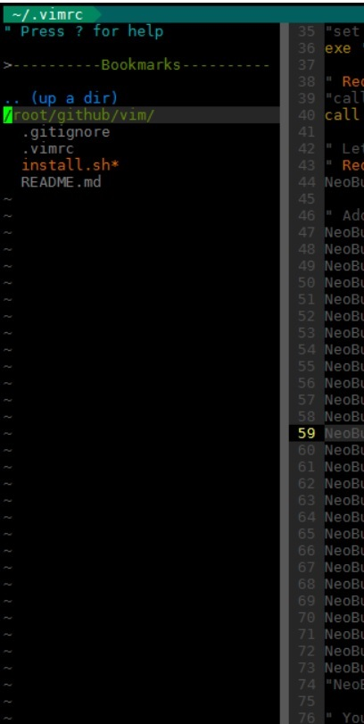

# vim-gigix
Plugins and customization for VIM.

Inspired by [spf13-vim](http://vim.spf13.com/).
  * More reactive
  * More fast to load

## Installation
```sh
curl https://raw.githubusercontent.com/gigi206/vim-gigix/master/install.sh -L -o - | sh
```
## Key mapping
  * `<F2>` for load [YouCompleteMe](#youcompleteme)
  * `<Tab>` for execute snippets ([ultisnips](#ultisnips) and [vim-snippets](#vim-snippets)) once plugin [YouCompleteMe](#youcompleteme) is loaded

## Modules
### vim-cursor
[vim-cursor](https://github.com/mmozuras/vim-cursor) go to previous position when opening a vim buffer.

### vim-colors-solarized
[vim-colors-solarized](https://github.com/altercation/vim-colors-solarized) is a vim theme.


### vim-airline
[vim-airline](https://github.com/vim-airline/vim-airline) is a color status/tabline bar.


### vim-airline-themes
[vim-airline-themes](https://github.com/vim-airline/vim-airline-themes) : themes for vim-airline.


### vim-indent-guides
[vim-indent-guides](https://github.com/nathanaelkane/vim-indent-guides) is a plugin for visually displaying indent levels in Vim.


### auto-pairs
[auto-pairs](https://github.com/jiangmiao/auto-pairs) insert or delete brackets, parens, quotes in pair.

### vim-multiple-cursors
[vim-multiple-cursors](https://github.com/terryma/vim-multiple-cursors) is a multiple selection feature into Vim.


### matchit.zip
[matchit.zip](http://www.vim.org/scripts/script.php?script_id=39) script allows you to configure % to match more than just single characters.

### vim-easy-align
[vim-easy-align](https://github.com/junegunn/vim-easy-align) is a simple, easy-to-use Vim alignment plugin.


### vim-easymotion
[vim-easymotion](https://github.com/easymotion/vim-easymotion) provides a much simpler way to use some motions in vim.


### vim-surround
[vim-surround](https://github.com/tpope/vim-surround)  is all about "surroundings": parentheses, brackets, quotes, XML tags, and more. The plugin provides mappings to easily delete, change and add such surroundings in pairs.

### vim-repeat
If you've ever tried using the `.` command after a plugin map, you were likely disappointed to discover it only repeated the last native command inside that map, rather than the map as a whole. That disappointment ends today. Repeat.vim remaps `.` in a way that plugins can tap into it. (Compatibility for [vim-surround](#vim-surround))

### wildfire.vim
[wildfire.vim](https://github.com/gcmt/wildfire.vim) can quickly select the closest text object among a group of candidates.


### nerdcommenter
[nerdcommenter](https://github.com/scrooloose/nerdcommenter) can do comments for some filetype.

### syntastic
[syntastic](https://github.com/vim-syntastic/syntastic) is a syntax checking.


### nerdtree
[nerdtree](https://github.com/scrooloose/nerdtree)allows you to explore your filesystem and to open files and directories. It presents the filesystem to you in the form of a tree which you manipulate with the keyboard and/or mouse. It also allows you to perform simple filesystem operations.


### vim-fugitive
[vim-fugitive](https://github.com/tpope/vim-fugitive) add git functionalities to Vim.

### vim-signify
[vim-signify](https://github.com/mhinz/vim-signify) uses signs to indicate added, modified and removed lines based on data of an underlying version control system.


### ctrlp.vim
[ctrlp.vim](https://github.com/ctrlpvim/ctrlp.vim) is a full path fuzzy file, buffer, mru, tag, ... finder for Vim.


### rainbow
[rainbow](https://github.com/luochen1990/rainbow) help you read complex code by showing diff level of parentheses in diff color.


### HTML-AutoCloseTag
[HTML-AutoCloseTag](https://github.com/vim-scripts/HTML-AutoCloseTag) automatically closes HTML tag once you finish typing it with `>`.

### gundo.vim
[gundo.vim](https://github.com/sjl/gundo.vim) is Vim plugin to visualize your Vim undo tree.


### tagbar
[tagbar](https://github.com/majutsushi/tagbar) is a Vim plugin that provides an easy way to browse the tags of the current file and get an overview of its structure. It does this by creating a sidebar that displays the ctags-generated tags of the current file, ordered by their scope. This means that for example methods in C++ are displayed under the class they are defined in.


### YouCompleteMe
[YouCompleteMe](https://github.com/Valloric/YouCompleteMe) is a fast, as-you-type, fuzzy-search code completion engine for Vim.


#### Requirements
  * for use : Vim compiled with `python`+ `python`
  * for compilation : `python` + `python-devel` + `cmake`+ `g++`+ `Exuberant Ctags`

#### Compilation
YCM has been compile with `./install.py`. If you want more see below :

1) If you want YCM with semantic support for C-family languages :
```sh
cd ~/.vim/bundle/YouCompleteMe
./install.py --clang-completer
```

2) To simply compile with everything enabled, there's a `--all` flag.  So, to install with all language features, ensure `xbuild`, `go`, `tsserver`, `node`, `npm`, `rustc`, and `cargo` tools are installed and in your `PATH`, then simply run :
```sh
cd ~/.vim/bundle/YouCompleteMe
./install.py --all
```
### vim-snippets
[vim-snippets](https://github.com/honza/vim-snippets) contains snippets files for various programming languages.

### ultisnips
[ultisnips](https://github.com/SirVer/ultisnips) is the ultimate solution for snippets in Vim. It has tons of features and is very fast.


## Troubleshooting
Disable **cursorline** `:set cursorline!` if you have some lags.
